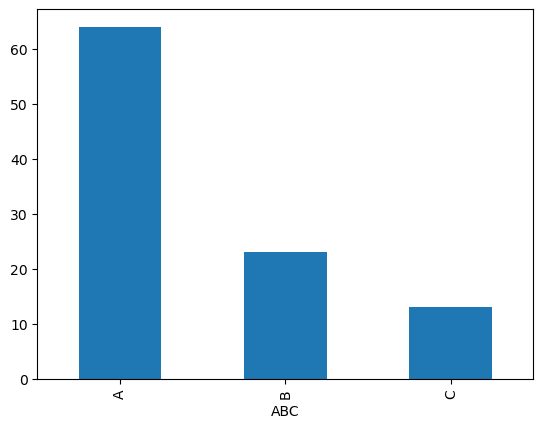
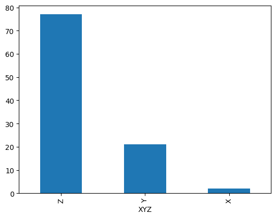
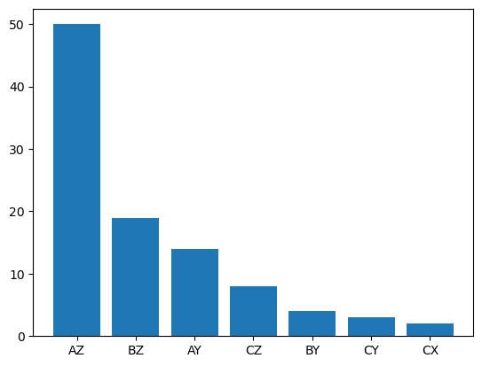

# Sales-Inventory-Analysis

## Inventory and Sales Analysis using ABC-XYZ Classification
Dataset srouce: https://www.kaggle.com/datasets/vinothkannaece/sales-dataset?resource=download
## Overview

This project analyses product sales data using ABC-XYZ classification to identify high-value products and understand demand variability.

## Tools Used

- Python
- Pandas
- NumPy
- Matplotlib

## Methodology

1. Data Cleaning
2. Exploratory Data Analysis
3. ABC Classification
4. XYZ Classification
5. ABC-XYZ Segmentation

## Results

### ABC Distribution

### XYZ Distribution

### ABC-XYZ Distribution

## Key Findings

- A-class products generated over 60% of cumulative revenue.
- Most products were classified as Z, indicating irregular demand.
- AZ was the largest ABC-XYZ category.
